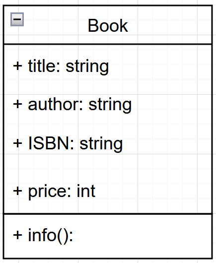

# Book Shop
This project implements a simple Book Shop system
It defines a Book class to represent books and allows users to manage book details such as title, author, ISBN, and price.

## Class
The Book class represents a book with the following attributes:
title (str): The title of the book.
author (str): The author of the book.
ISBN (str): A unique identifier for the book.
price (float): The price of the book.
Methods:
info(self): Displays book details in a formatted manner.

## Object
The project allows users to create multiple book objects and interact with them.

## UML Class Diagram
Here is my UML image:

