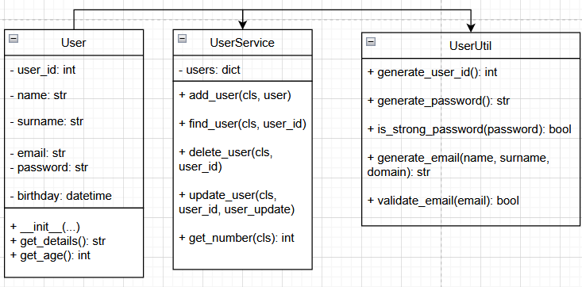

# User Management System

## Overview
This project implements a simple user management system using object-oriented programming principles in Python. It consists of three classes:

1. **User** - Represents a user with personal details.
2. **UserService** - Manages multiple users.
3. **UserUtil** - Provides utility functions such as generating user IDs, passwords, and emails.

## Classes and Attributes

### User Class
- **Attributes:**
  - `user_id` (int): Unique identifier for the user.
  - `name` (str): First name of the user.
  - `surname` (str): Last name of the user.
  - `email` (str): Email of the user.
  - `password` (str): Password of the user.
  - `birthday` (datetime): Birthday of the user.
- **Methods:**
  - `__init__(self, user_id, name, surname, birthday, email, password)`: Initializes user details.
  - `get_details(self)`: Returns formatted user details.
  - `get_age(self)`: Calculates and returns the user's age.

### UserService Class
- **Class Attribute:**
  - `users` (dict): Stores users with `user_id` as the key and `User` object as the value.
- **Class Methods:**
  - `add_user(cls, user)`: Adds a new user.
  - `find_user(cls, user_id)`: Searches for a user by `user_id`.
  - `delete_user(cls, user_id)`: Deletes a user by `user_id`.
  - `update_user(cls, user_id, user_update)`: Updates user attributes.
  - `get_number(cls)`: Returns the number of users.

### UserUtil Class
- **Static Methods:**
  - `generate_user_id()`: Generates a unique user ID.
  - `generate_password()`: Creates a secure password.
  - `is_strong_password(password)`: Checks password strength.
  - `generate_email(name, surname, domain)`: Generates an email based on name and surname.
  - `validate_email(email)`: Validates an email format.

## Usage

1. **Create a User**
```python
user = User(UserUtil.generate_user_id(), 'Nurali', 'Bakytbek', (2005, 8, 22))
```

2. **Add User to Service**
```python
UserService.add_user(user)
```

3. **Retrieve User Details**
```python
print(user.get_details())
```

4. **Find User by ID**
```python
found_user = UserService.find_user(#user_id)
if found_user:
    print("User found:", found_user.get_details())
```

5. **Delete a User**
```python
UserService.delete_user(#user_id)
```

6. **Generate User ID and Password**
```python
new_user_id = UserUtil.generate_user_id()
new_password = UserUtil.generate_password()
print(f"New User ID: {new_user_id}, New Password: {new_password}")
```

## Conclusion
This project provides a basic implementation of user management using object-oriented programming in Python. It includes functionalities for user creation, management, and validation.

## UML Class Diagram
Here is my UML image:

