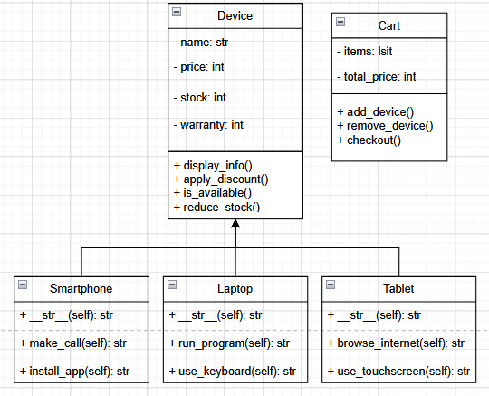

# Electronic Device Shopping Cart

## Overview
This project is a simple shopping cart system for electronic devices, demonstrating the principles of Object-Oriented Programming (OOP) and inheritance in Python. Customers can browse, add items to their cart, and purchase electronic devices like smartphones, laptops, and tablets. The system also manages stock and applies discounts.

## Features
- **Device Management**: Supports Smartphones, Laptops, and Tablets with unique attributes.
- **Shopping Cart**: Users can add, remove, and manage their selected items.
- **Stock Control**: Prevents purchasing more than available stock.
- **Checkout System**: Finalizes purchases and updates stock.

## Class Structure
### `Device (Base Class)`
Represents a generic electronic device with common attributes.
- **Attributes**:
  - `name` (str): Name of the device.
  - `price` (float): Price of the device.
  - `stock` (int): Available stock.
  - `warranty_period` (int): Warranty in months.
- **Methods**:
  - `display_info()`: Displays device details.
  - `apply_discount(discount_percentage)`: Applies a discount to the price.
  - `is_available(amount)`: Checks if stock is sufficient.
  - `reduce_stock(amount)`: Deducts stock after purchase.

### `Smartphone (Inherits from Device)`
- **Additional Attributes**:
  - `screen_size` (float): Screen size in inches.
  - `battery_life` (int): Battery life in hours.
- **Methods**:
  - `make_call()`: Simulates making a call.
  - `install_app()`: Simulates installing an app.

### `Laptop (Inherits from Device)`
- **Additional Attributes**:
  - `ram_size` (int): RAM in GB.
  - `processor_speed` (float): Processor speed in GHz.
- **Methods**:
  - `run_program()`: Simulates running a program.
  - `use_keyboard()`: Simulates typing.

### `Tablet (Inherits from Device)`
- **Additional Attributes**:
  - `screen_resolution` (str): Resolution of the screen.
  - `weight` (int): Weight in grams.
- **Methods**:
  - `browse_internet()`: Simulates browsing.
  - `use_touchscreen()`: Simulates touchscreen use.

### `Cart`
Handles shopping cart operations.
- **Attributes**:
  - `items` (list): List of (device, quantity) tuples.
  - `total_price` (float): Total cost of items.
- **Methods**:
  - `add_device(device, amount)`: Adds items to the cart.
  - `remove_device(device, amount)`: Reduces item quantity or removes from the cart.
  - `get_total_price()`: Returns the total cost.
  - `print_items()`: Displays cart contents.
  - `checkout()`: Completes purchase and updates stock.

## Running the Program
### Prerequisites
- Python 3.x installed.

### Steps to Run
1. Clone the repository:
   ```sh
   git clone <repository-url>
   cd electronic-shopping-cart
   ```
2. Run the script:
   ```sh
   python main.py
   ```
3. Follow the menu options:
   - `1` Show available devices.
   - `2` Add a device to the cart.
   - `3` Show cart items.
   - `4` Checkout.
   - `5` Exit.

## Sample Run
```
Available Devices:
1. iPhone 13 - $999, Stock: 5
2. MacBook Pro - $1999, Stock: 3
3. Samsung Tablet - $499, Stock: 7

Select an option:
> 2 (Add to cart)
Enter device number: 1
Enter quantity: 2
Added 2 x iPhone 13 to cart.

> 3 (Show cart)
iPhone 13 x2 - $1998

> 4 (Checkout)
Purchase successful!
Remaining Stock:
iPhone 13: 3 left
```

## UML Class Diagram
Here is my UML image:


