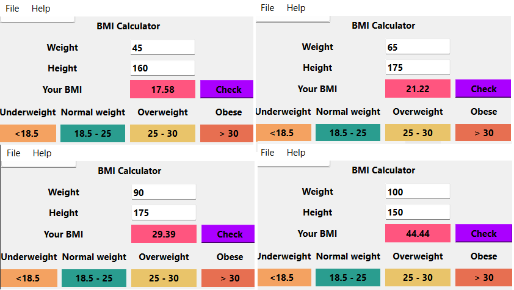

# BMI Calculator

## Objective
The **BMI Calculator** is a PyQt-based application that allows users to calculate their **Body Mass Index (BMI)**. The application determines the user's BMI status according to the **Department of Health and Human Services/National Institutes of Health** guidelines.

## Features
- **User-friendly interface** built with PyQt.
- Allows users to enter their **weight (kg)** and **height (m)**.
- Provides a "Calculate BMI" button to compute the BMI.
- Displays the **calculated BMI** and **BMI status**.
- Implements a **menu bar** with options to **clear inputs**, **exit the application**, and **view help documentation**.
- Categorizes BMI into four groups:
  - **Underweight**: BMI < 18.5
  - **Normal**: BMI between 18.5 and 25
  - **Overweight**: BMI between 25 and 30
  - **Obese**: BMI ≥ 30

## How to Use
1. **Enter your weight (kg)** in the designated input field.
2. **Enter your height (m)** in the respective field.
3. Click the **"Calculate BMI"** button.
4. Your **BMI value** and corresponding **BMI status** will be displayed.
5. Use the **"Clear"** option from the menu to reset the inputs.
6. Select **"Help"** from the menu to view additional information.
7. Click **"Exit"** to close the application.

## Menu Options
- **File**
  - **Clear**: Resets input fields.
  - **Exit**: Closes the application.
- **Help**
  - Displays information on how to use the BMI calculator.

## BMI Calculation Formula
The Body Mass Index (BMI) is calculated using the formula:

BMI = Weight (kg) / [Height (m)]²
\[
\text{BMI} = \frac{\text{Weight (kg)}}{\text{Height (m)}^2}
\]

## Screenshots

## Sample Input/Output
**Example 1:**
- **Input**: Weight = 70 kg, Height = 1.75 m
- **Output**: BMI = 22.86 (Normal)

