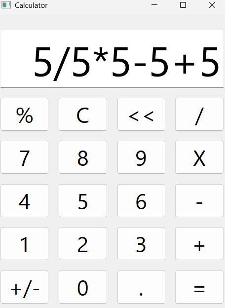

# Calculator

## Objective:
The goal of this project is to create a calculator application that can perform basic arithmetic operations (addition, subtraction, multiplication, division) following the Model-View-Controller (MVC) design pattern. The calculator has a simple, user-friendly graphical interface designed with PyQt.

## Project Structure:

- **Model (Calculator Logic):** Handles the core calculator logic, including mathematical operations.
- **View (GUI):** The user interface designed with PyQt for interacting with the user.
- **Controller:** Manages the interaction between the View (GUI) and the Model (Calculator class).

## Features:
- Perform basic arithmetic operations (addition, subtraction, multiplication, division).
- Clear button (C) to reset the calculator.
- Handles errors (e.g., division by zero).
- Responsive and user-friendly interface.

## Classes:

### 1. Calculator (Model)
This class represents the core calculator logic.

#### Attributes:
- **expression (str):** Holds the current mathematical expression as a string.

#### Methods:
- `__init__(self)`: Initializes the Calculator object with an empty expression.
- `add_to_expression(self, char: str)`: Adds a new character (digit/operator) to the current expression.
- `remove_last_character(self)`: Removes the last character from the expression.
- `clear_expression(self)`: Clears the entire expression.
- `calculate(self)`: Evaluates the expression and returns the result or an error message.
- `get_expression(self)`: Returns the current mathematical expression as a string.

### 2. CalculatorWindow (Controller)
This class manages the interaction between the View and the Model.

#### Attributes:
- `button0, button1, button2, … button9`: QPushButton instances for digit buttons.
- `button_plus, button_minus, button_mul, button_div, button_clear`: QPushButton instances for operation buttons.
- `input`: QLineEdit instance to display input and results.
- `calculator`: The Calculator object responsible for computation.

#### Methods:
- Event handlers for handling button presses.
- Updates the expression in the calculator and displays the result in the QLineEdit.
- Handles error conditions like division by zero.

### 3. **Test the calculator:**
   - The interface will appear, and you can input digits, operators, and calculate results using the "=" button.
   - Use the "C" button to clear the expression.

### Sample Input/Output:

#### Example 1:
**Input: 5+5**
**Output: 10**

### Screenshot

### Output: 5
