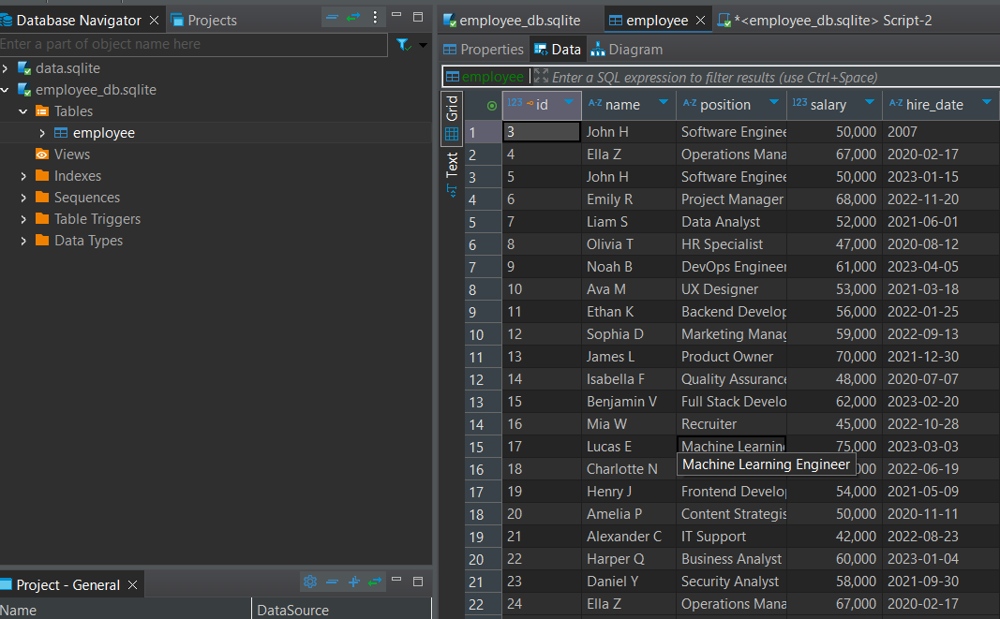
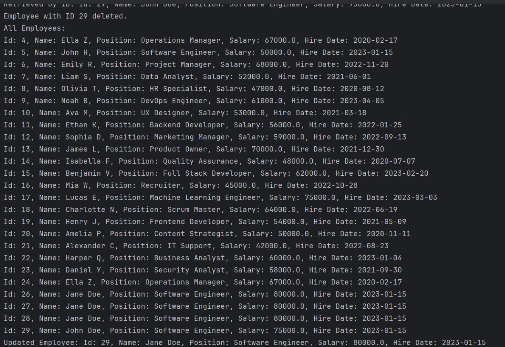

# Employee Database Management System

A simple Python application that uses SQLite to manage employee records. This project demonstrates how to implement CRUD (Create, Read, Update, Delete) operations with a relational database using object-oriented programming.

---

## Features

- Create an employee record
- Read employee details (by ID or all employees)
- Update employee information
- Delete an employee record

---

## Database Schema

**Table: `employee`**

| Column     | Type     | Description                    |
|------------|----------|--------------------------------|
| `id`       | INTEGER  | Primary Key, Auto-incremented  |
| `name`     | TEXT     | Employee's full name           |
| `position` | TEXT     | Job title                      |
| `salary`   | REAL     | Salary                         |
| `hire_date`| TEXT     | Hire date (e.g., `2024-01-15`) |

---

## Screenshots

